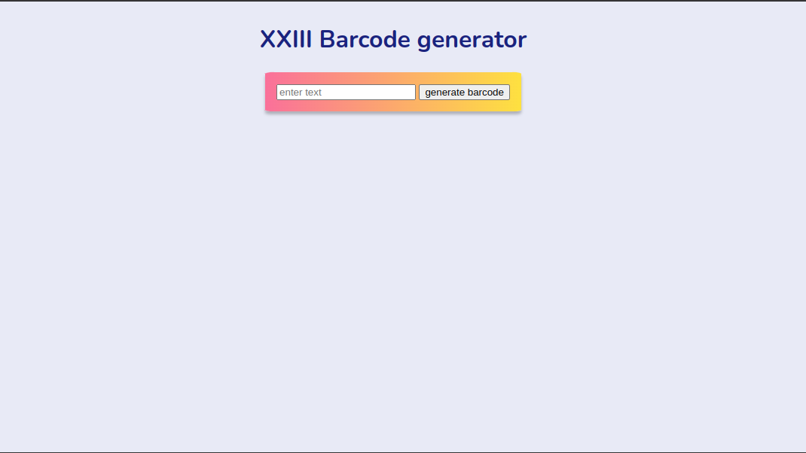
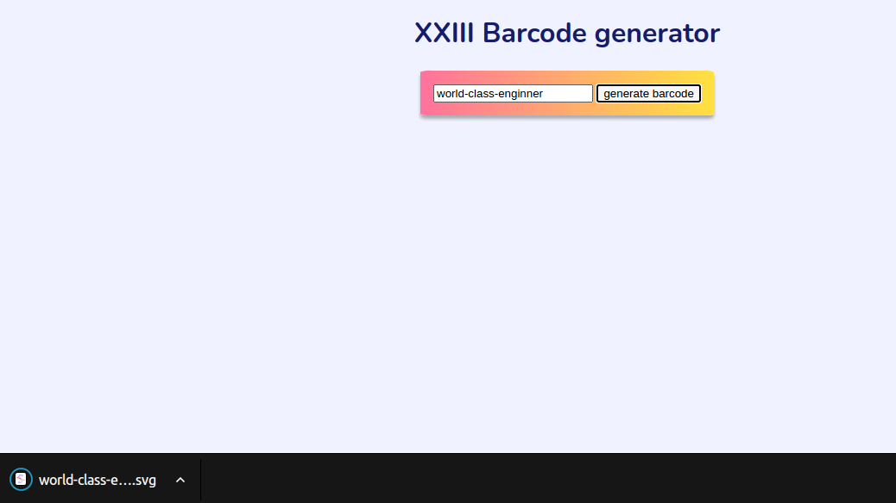

# XXIII Barcode Generator

Convert your text to barcodes

# Setup
* Clone the Repo (you should obviously do this)
* change directory `cd  XXIII-Barcode-Generator`
* Run `npm install`

# Run the Application
Start the application by running `npm run barcode` then visit your application on http://localhost:2323

* Enter text that you would love to convert to barcode `as seen in image below`

* An SVG format of the barcode is then downloaded and stored on the project folder

# Credits

* This project was inspired by Michael okoh
- GitHub [@ichtrojan](https://{github.com/ichtrojan})
-repo [repo](https://github.com/ichtrojan/Barcode-Generator)

## Contact

- GitHub [@techrook](https://{github.com/techrook})
- Twitter [@itohowo23](https://{twitter.com/itohowo23})

